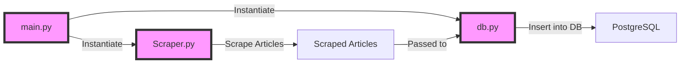

```mermaid
graph LR;

A[main.py] -- Instantiate --> B[Scraper.py]
A[main.py] -- Instantiate --> F[db.py]
B -- Scrape Articles --> C[Scraped Articles]
C -- Passed to --> F
F -- Insert into DB --> G[PostgreSQL]

classDef module fill:#f9f,stroke:#333,stroke-width:4px;
class A,B,F module

```